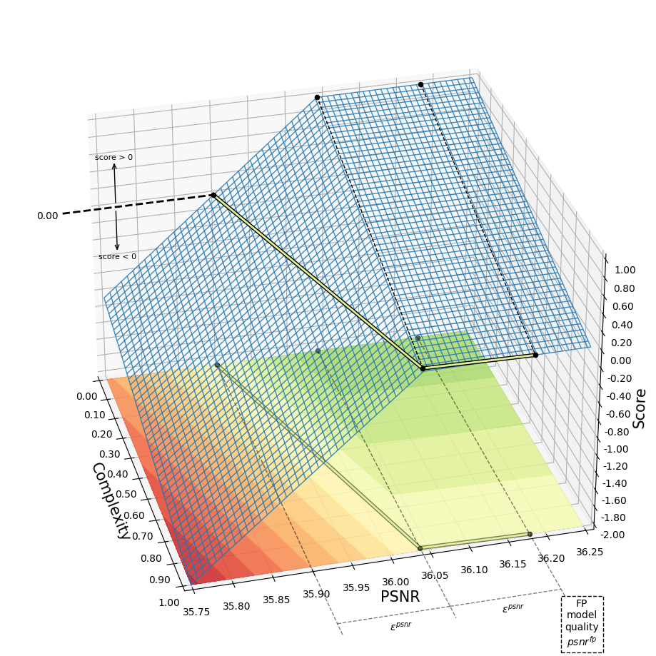

# Binary Super-Resolution Challenge, 2023

:link: Competition website: http://cscontest.ru/bsrc/

* [Description](#sec-description)
    - [Goal](#subsec-goal)
    - [Models](#subsec-models)
    - [Restrictions](#subsec-restrictions)
* [Evaluation](#sec-evaluation)
    - [Complexity metric](#subsec-complexity-metric)
    - [Quality metric](#subsec-quality-metric)
    - [Scoring metric](#subsec-scoring-metric)
    - [Final metric](#subsec-final-metric)
* [Submission](#sec-submission)
    - [Description](#subsec-description)
    - [Testing](#subsec-testing)
* [Baselines](#sec-baselines)
    - [Requirements and Installation](#subsec-requirements-and-installation)
    - [Downloading datasets](#subsec-downloading-datasets)
    - [Training](#subsec-training)
    - [Evaluating](#subsec-evaluating)

<a name="sec-description"></a>
## Description

<a name="subsec-goal"></a>
### Goal

The goal of the challenge is to achieve the partially or fully binary models for super-resolution task for **x2** and **x4** scales ($`\text{model}_{\text{x2}}^{\text{bin}}`$ and $`\text{model}_{\text{x4}}^{\text{bin}}`$).  
The less complexity metric the model has, the better.  
The more peak signal-to-noise ratio (PSNR) the model has on test dataset, the better.

<a name="subsec-models"></a>
### Models

The base model for **x2** and **x4** scale ($`\text{model}_{\text{x2}}^{\text{fp}}`$ and $`\text{model}_{\text{x4}}^{\text{fp}}`$) are based on EDSR and SRResNet architectures respectively.  
The correspinding checkpoints can be found in the folder `./checkpoints` and can be trained from scratch using this repository.

<a name="subsec-restrictions"></a>
### Restrictions

We count only matrix multiplications operations of binarized tensors as binary multiply–accumulate operations (MACs).

You can binarize the model's matrix operation in any way you want, but the following requirements must be satisfied, in order to count this operation as the binary:

- This operation must be represented as conv2d, conv2d_transpose or linear layer in the model.
- This layer must be wrapped in `BinaryConv2d`, `BinaryConv2dTranspose` or `BinaryLinear` layer.
- If the `module` is the instance of one of the classes mentioned above, then the binarization process must happen in `module.input_binarizer(x)` and `module.weight_binarizer(module.weight)` for input activations `x` and module weights `module.weight`, respectively.

For simplicity, we provide the baseline code and the training pipeline.
You can use it to train your models.

<a name="sec-evaluation"></a>
## Evaluation

Evaluation is performed on closed test dataset: *ShadowSet*.  
The metric for leaderboard (score) is based on computation complexity metric and its quality - PSNR metric value for each model.

<a name="subsec-complexity-metric"></a>
### Complexity metric

The complexity metric of the model depends on the amount of MACs and defined by the following formula:

```math
\text{compexity}\left(\text{model}_{\text{x2}}^{\text{bin}}\right) = \text{c}_{\text{x2}}^{\text{bin}} = \frac{1}{\text{MAC}^{\text{fp}}\left(\text{model}_{\text{x2}}^{\text{fp}}\right)}\left(\text{MAC}^{\text{fp}}\left(\text{model}_{\text{x2}}^{\text{bin}}\right) + \frac{1}{8}\text{MAC}^{\text{bin}}\left(\text{model}_{\text{x2}}^{\text{bin}}\right)\right).
```

The same formula for **x4** model:
```math
\text{compexity}\left(\text{model}_{\text{x4}}^{\text{bin}}\right) = \text{c}_{\text{x4}}^{\text{bin}} = \frac{1}{\text{MAC}^{\text{fp}}\left(\text{model}_{\text{x4}}^{\text{fp}}\right)}\left(\text{MAC}^{\text{fp}}\left(\text{model}_{\text{x4}}^{\text{bin}}\right) + \frac{1}{8}\text{MAC}^{\text{bin}}\left(\text{model}_{\text{x4}}^{\text{bin}}\right)\right),
```
where the functions $`\text{MAC}^{\text{fp}}(\cdot)`$ and $`\text{MAC}^{\text{bin}}(\cdot)`$ denote the number of MAC operations for float point (fp) and binary operations (bin) respectively. The values $`\text{MAC}^{\text{fp}}\left(\text{model}_{\text{x2}}^{\text{fp}}\right)`$ and $`\text{MAC}^{\text{fp}}\left(\text{model}_{\text{x4}}^{\text{fp}}\right)`$ are calculated and strictly fixed, these values are corresponds to the checkpoints of the float point models $`\text{model}_{\text{x2}}^{\text{fp}}`$ and $`\text{model}_{\text{x4}}^{\text{fp}}`$ respectively.

<a name="subsec-quality-metric"></a>
### Quality metric

Quality metrics $`\text{psnr}_{\text{x2}}^{\text{fp}}`$, $`\text{psnr}_{\text{x4}}^{\text{fp}}`$, $`\text{psnr}_{\text{x2}}^{\text{bin}}`$, $`\text{psnr}_{\text{x4}}^{\text{bin}}`$ for float point and binarized **x2** and **x4** models, respectively, are based on average PSNR metric value on test dataset.

<a name="subsec-scoring-metric"></a>
### Scoring metric

The score is calculated for each model separately and based on complexity metric and the model quality (PSNR). The formula for the score is the following:

```math
\text{score}\left(\text{model}_{\text{x2}}^{\text{bin}}\right) = 
\begin{cases}
\frac{1 - \epsilon_{\text{x2}}^{\text{c}}}{\epsilon_{\text{x2}}^{psnr}} \cdot \left(\text{psnr}_{\text{x2}}^{\text{bin}} + \epsilon_{\text{x2}}^{\text{psnr}} - \text{psnr}_{\text{x2}}^{\text{fp}}\right) + \left(1 - \epsilon_{\text{x2}}^{\text{c}} - \text{c}_{\text{x2}}^{\text{bin}}\right), & \text{psnr}_{\text{x2}}^{\text{bin}} + \epsilon_{\text{x2}}^{\text{psnr}} < \text{psnr}_{\text{x2}}^{\text{fp}} \\
\frac{\epsilon_{\text{x2}}^{\text{c}}}{\epsilon_{\text{x2}}^{psnr}} \cdot \left(\text{psnr}_{\text{x2}}^{\text{bin}} + \epsilon_{\text{x2}}^{\text{psnr}} - \text{psnr}_{\text{x2}}^{\text{fp}}\right) + \left(1 - \epsilon_{\text{x2}}^{\text{c}} - \text{c}_{\text{x2}}^{\text{bin}}\right), & \text{otherwise}.
\end{cases}
```

The same formula for **x4** model:
```math
\text{score}\left(\text{model}_{\text{x4}}^{\text{bin}}\right) = 
\begin{cases}
\frac{1 - \epsilon_{\text{x4}}^{\text{c}}}{\epsilon_{\text{x4}}^{psnr}} \cdot \left(\text{psnr}_{\text{x4}}^{\text{bin}} + \epsilon_{\text{x4}}^{\text{psnr}} - \text{psnr}_{\text{x4}}^{\text{fp}}\right) + \left(1 - \epsilon_{\text{x4}}^{\text{c}} - \text{c}_{\text{x4}}^{\text{bin}}\right), & \text{psnr}_{\text{x4}}^{\text{bin}} + \epsilon_{\text{x4}}^{\text{psnr}} < \text{psnr}_{\text{x4}}^{\text{fp}} \\
\frac{\epsilon_{\text{x4}}^{\text{c}}}{\epsilon_{\text{x4}}^{psnr}} \cdot \left(\text{psnr}_{\text{x4}}^{\text{bin}} + \epsilon_{\text{x4}}^{\text{psnr}} - \text{psnr}_{\text{x4}}^{\text{fp}}\right) + \left(1 - \epsilon_{\text{x4}}^{\text{c}} - \text{c}_{\text{x4}}^{\text{bin}}\right), & \text{otherwise}.
\end{cases}
```

The $`\epsilon_{\text{x2}}^{\text{c}}`$, $`\epsilon_{\text{x4}}^{\text{c}}`$ are the complexity metric correction constants, the $`\epsilon_{\text{x2}}^{\text{psnr}}`$, $`\epsilon_{\text{x4}}^{\text{psnr}}`$ are the margin of error that is used to determine whether $`\text{model}_{\text{x2}}^{\text{bin}}`$ or $`\text{model}_{\text{x4}}^{\text{bin}} `$ is lossless or not. These constants and $`\text{psnr}_{\text{x2}}^{\text{fp}}`$, $`\text{psnr}_{\text{x4}}^{\text{fp}}`$ are predefined and strictly fixed:

| Constant | Value |  | Constant | Value | |
| :---:      | :---:      | ---      | :---:      | :---:      |:---      |
| $`\epsilon_{\text{x2}}^{\text{c}}`$   | 0.01 |  | $`\epsilon_{\text{x4}}^{\text{c}}`$   | 0.01   | |
| $`\epsilon_{\text{x2}}^{\text{psnr}}`$   | 0.16 |  | $`\epsilon_{\text{x4}}^{\text{psnr}}`$   | 0.08   | |
| $`\text{psnr}_{\text{x2}}^{\text{fp}}`$   | 36.19 |  | $`\text{psnr}_{\text{x4}}^{\text{fp}}`$   | 29.00   | for *ShadowSet* |
| $`\text{psnr}_{\text{x2}}^{\text{fp}}`$   | 33.59 |  | $`\text{psnr}_{\text{x4}}^{\text{fp}}`$   | 28.46   | for Set14 |

To have better understanding of the scoring metric function for the model one can see on the following picture:  



For the FP model the score is equal to the zero. In general, to obtain better score the complexity should be reduced and the quality should more than $`\text{psnr}_{\text{x}\cdot}^{\text{fp}} - \epsilon_{\text{x}\cdot}^{\text{psnr}}`$. One can see the projection  on complexity vs. PSNR surface, the greener, the better.

> Notes:  
> 1. If the $`\text{score}\left(\text{model}_{\text{x}\cdot}^{\text{bin}}\right)`$ will be less than 0.0 it will be replaced with zero as score for $`\text{model}_{\text{x}\cdot}^{\text{fp}}`$  
> 2. If the $`\text{compexity}\left(\text{model}_{\text{x}\cdot}^{\text{bin}}\right)`$ will be more than 1.0 the model will be replaced with $`\text{model}_{\text{x}\cdot}^{\text{fp}}`$, so the score will be zero as for $`\text{model}_{\text{x}\cdot}^{\text{fp}}`$

<a name="subsec-final-metric"></a>
### Final metric

The score for leaderboard is the weighted sum of the two scores for $`\text{model}_{\text{x2}}^{\text{bin}}`$ and $`\text{model}_{\text{x4}}^{\text{bin}}`$:

```math
\text{FinalScore}\left(\text{model}_{\text{x2}}^{\text{bin}}, \text{model}_{\text{x4}}^{\text{bin}}\right) = 0.4 \cdot \text{score}\left(\text{model}_{\text{x2}}^{\text{bin}}\right) + 0.6 \cdot \text{score}\left(\text{model}_{\text{x4}}^{\text{bin}}\right).
```
> Notes:  
> If the $`\text{model}_{\text{x2}}^{\text{bin}}`$ or  $`\text{model}_{\text{x4}}^{\text{bin}}`$ will not be provided the score for this model will be equal to zero as for $`\text{model}_{\text{x2}}^{\text{fp}}`$ or $`\text{model}_{\text{x4}}^{\text{fp}}`$


<a name="sec-submission"></a>
## Submission

<a name="subsec-description"></a>
### Description

We expect you to submit the zip archive of work repository and models' checkpoints:  
* `repository.zip` using the command `zip -r repository.zip path/to/repository/`
* $`\text{model}_{\text{x2}}^{\text{bin}}`$ checkpoint (if it will not be provided it will be replaced with $`\text{model}_{\text{x2}}^{\text{fp}}`$)  
* $`\text{model}_{\text{x4}}^{\text{bin}}`$ checkpoint (if it will not be provided it will be replaced with $`\text{model}_{\text{x4}}^{\text{fp}}`$)

To load the models, you need to provide `load` function placed in `/path/to/competition/load.py`.  
Do not change the location of the `load.py` file or rename `load` function.

For example, if the submitted model is `.ckpt` file, then the `load.py` file can look like this:

```
import torch


def load(model_path, scale):
    return torch.load(model_path, map_location=torch.device("cpu")) if model_path else None
```

<a name="subsec-testing"></a>
### Testing

For model testing, we use private dataset: *ShadowSet*. By the way, you also can check that everything is fine by running the following command and check your score on Set14 dataset: 

```
python test.py --scalex2_model path/to/scalex2/checkpoint --scalex4_model path/to/scalex4/checkpoint
```

<a name="sec-baselines"></a>
## Baselines

<a name="subsec-requirements-and-installation"></a>
### Requirements and Installation
We recommend to use `python 3.7.13`.  

1. Create the folder and clone the repository.  

2. Add the following line to the end of your ~/.bashrc file to help python find this framework:

```
export PYTHONPATH=/path/to/this/repository:$PYTHONPATH
```

3. Install requirements by running the following command from the repository root folder:

```
pip install -r bnn_competition/requirements.txt
```

<a name="subsec-downloading-datasets"></a>
### Downloading datasets

We use [DIV2K](https://disk.yandex.ru/d/9-mUB9Y-9gN3kQ) dataset for training, and [Set5, Set4, B100, Urban100](https://disk.yandex.ru/d/778zLOff8iMk0w) datasets for benchmarking models.

1. Download datasets and extract it.  
2. Change paths in `bnn_competition/dataloaders/datasets_info.py` file.


<a name="subsec-training"></a>
### Training

To train the models, we use Pytorch Lightning framework, but you can use anything you want. The only requirement here is that the binary model which you upload to the competition is a torch model.

The following pipeline of achieving the scalex2 baseline model for competition is written for Pytorch Lightning.

Start training the model by running the command:

```
python bnn_competition/main.py --config bnn_competition/examples/bnn/scalex2_baseline-0.yaml --logdir results/scalex2_baseline-0 --gpu=0
```

You also can train in the same way baselines 0th and 1st for **x2** and **x4** models as full precision models. The full list of the commands and corresponding results one can find below.

|        Model         | compexity(·) |   Set5  |  Set14  |   B100  | Urban100 | *ShadowSet* | |
| :---      | :---:      | :---:      | :---:      | :---:      | :---:      | :---:      | :---     |
|    **Full precision** scale **x2** model     |   1.0000   | 38.0601 | 33.5951 | 32.1903 | 32.0406  |  36.1909  | `python bnn_competition/main.py --config bnn_competition/examples/fp/fp_scalex2.yaml --logdir results/scalex2_fp --gpu=0` |
|  Baseline 0th of binarized scale **x2** model      |   0.2526   | 37.6146 | 33.0858 | 31.8454 | 30.8008  |  35.1658  | `python bnn_competition/main.py --config bnn_competition/examples/bnn/scalex2_baseline-0.yaml --logdir results/scalex2_baseline-0 --gpu=0` |
|  Baseline 1st of binarized scale **x2** model      |   0.6946   | 37.9573 | 33.5144 | 32.1433 | 31.8393  |  36.0363  | `python bnn_competition/main.py --config bnn_competition/examples/bnn/scalex2_baseline-1.yaml --logdir results/scalex2_baseline-1 --gpu=0` |
|    **Full precision** scale **x4** model     |   1.0000   | 31.9869 | 28.4585 | 27.4632 | 25.6885  |  29.0043  | `python bnn_competition/main.py --config bnn_competition/examples/fp/fp_scalex4.yaml --logdir results/scalex4_fp --gpu=0` |
|  Baseline 0th of binarized scale **x4** model     |   0.7718   | 31.7247 | 28.2973 | 27.3642 | 25.4189  |  28.7419  | `python bnn_competition/main.py --config bnn_competition/examples/bnn/scalex4_baseline-0.yaml --logdir results/scalex4_baseline-0 --gpu=0` |
|  Baseline 1st of binarized scale **x4** model      |   0.8141   | 31.9027 | 28.4166 | 27.4269 | 25.6058  |  28.9398  | `python bnn_competition/main.py --config bnn_competition/examples/bnn/scalex4_baseline-1.yaml --logdir results/scalex4_baseline-1 --gpu=0` |


<a name="subsec-evaluating"></a>
### Evaluating

To evaluate the model, run the following script

```
import torch
from bnn_competition.evaluation import Evaluator


scalex2_model = torch.load("results/scalex2_baseline/version_0/model.ckpt")
Evaluator().evaluate(scalex2_model=scalex2_model)
```

Evaluator should print the following table with approximately the same PSNR values 

```
+----------------------+------------+---------+---------+---------+----------+
|        Model         | complexity |   set5  |  set14  |   b100  | urban100 |
+----------------------+------------+---------+---------+---------+----------+
|    scalex2_model     |   1.0000   | 38.0601 | 33.5951 | 32.1903 | 32.0406  |
| binary scalex2_model |   0.2526   | 37.6146 | 33.0858 | 31.8454 | 30.8008  |
+----------------------+------------+---------+---------+---------+----------+
```


